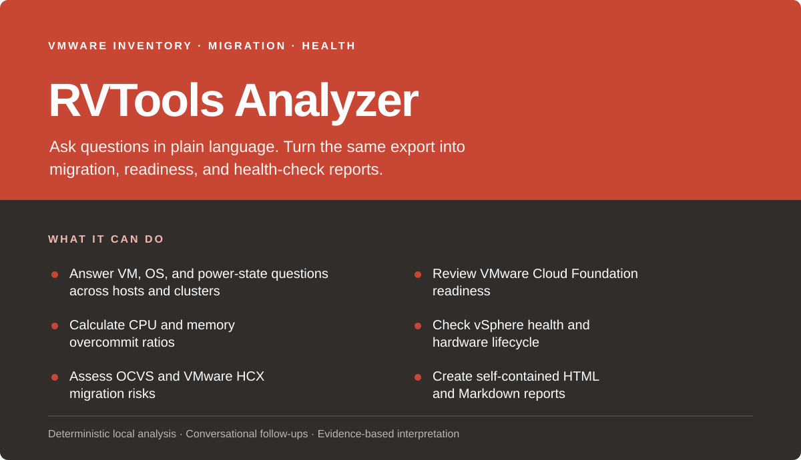

## Sample reports

- [Download the synthetic health-check sample (PDF)](pdf/health-check-report-sample.pdf)
- [Download the synthetic OCVS migration sample (PDF)](pdf/ocvs-migration-analysis-sample.pdf)

Both reports use fully synthetic data and contain no customer-derived inventory.

## Requirements

You will need:

- Claude Code, Claude Desktop, or Codex/ChatGPT desktop with the relevant skill or plugin support.
- Python 3.8 or newer with the standard-library `venv` module.
- Network access on first use if the pinned Python dependencies are not already available.

The launcher does not use `sudo` or install packages globally. If the required packages are missing, it creates a private Python environment in the plugin's writable data directory and installs pinned, hash-verified versions of `openpyxl`, `et_xmlfile`, and `defusedxml` there.

## Install with Claude

### Claude Code CLI

```bash
claude plugin marketplace add KimTholstorf/rvtools-skill
claude plugin install rvtools@rvtools-analyzer
```

If Claude asks for a plugin reload, run `/reload-plugins` or start a fresh session.

You can chat normally or call the command directly:

```text
/rvtools:analyze How many powered-off VMs are in this workbook?
```

### Claude Desktop

1. Open the [latest GitHub release](https://github.com/KimTholstorf/rvtools-skill/releases/latest).
2. Under **Assets**, download `rvtools-skill-<version>.zip`. Do not use GitHub's automatically generated source-code ZIP.
3. In Claude Desktop, open **Settings → Customize → Skills → Add → Upload a skill**.
4. Select the downloaded ZIP and enable **RVTools Analyzer**.

The release ZIP is built only after the tagged commit passes CI. It contains the standalone skill bundle expected by Claude Desktop. Once enabled, just start a conversation and attach an RVTools export. The `/rvtools:analyze` command is only part of the Claude Code plugin installation.

## Install in Codex

```bash
codex plugin marketplace add KimTholstorf/rvtools-skill --ref main
codex plugin add rvtools-analyzer@rvtools-analyzer
```

You can also find RVTools Analyzer in the ChatGPT desktop Plugins Directory after adding the marketplace. Start a new task once installation finishes.

Then chat normally or invoke the skill explicitly:

```text
$rvtools-analyzer Run an OCVS migration analysis on this RVTools export.
```

## Examples

Attach an RVTools `.xlsx` export, or provide its local path, and ask something like:

- “How many virtual machines are powered off?”
- “How many Linux VMs run in each cluster?”
- “What are the CPU and memory overcommit ratios for cluster Production?”
- “List the host vendors, models, CPU models, and Hyper-Threading state.”
- “Run a vSphere health check and create an HTML report.”
- “Assess this environment for an OCVS migration using HCX.”

Short factual questions get a direct answer in chat. A full assessment creates an HTML report in an interactive session or a Markdown report in a file-oriented session, unless you ask for a different supported format.

## Data handling and privacy

An RVTools export can describe nearly every corner of a VMware environment, so treat it like sensitive infrastructure documentation. The skill tells the agent to:

- Keep the workbook, parser output, and SQLite query index local.
- Preserve the source workbook and write reports separately.
- Exclude annotations, snapshot descriptions, credentials, license keys, and serial numbers from the conversational index.
- Return bounded examples rather than full infrastructure inventories.
- Use only vendor and model identifiers—not the raw workbook—when researching hardware lifecycle status.

The parser and query scripts do not contain code that uploads the workbook. If you attach the file to Claude or ChatGPT, the platform's own file-handling and retention terms still apply. On first use, the launcher may contact the configured Python package index to download its pinned dependencies. Hardware lifecycle and compatibility checks may also consult public vendor documentation, but they use vendor and model identifiers rather than the workbook itself.

## Scope and limitations

An RVTools export is a snapshot, not a readiness certificate. It cannot prove that a migration will work from end to end. Final decisions still need the relevant VMware HCX validation, a target design review, hardware compatibility or BOM checks, performance history, licensing confirmation, and current vendor documentation.

The reports label project thresholds as heuristics rather than vendor limits. Product support, compatibility, licensing, and lifecycle details change over time, so the agent must check current primary sources before relying on them.

## Development

Run the automated tests:

```bash
PYTHONDONTWRITEBYTECODE=1 python3 -m unittest discover -s tests
```

Validate Claude packaging:

```bash
claude plugin validate --strict .
```

Codex plugin and skill manifests live under `.codex-plugin/`, `.agents/plugins/`, and `skills/`.

## Versioning

RVTools Analyzer follows semantic versioning. Until 1.0, interfaces and finding thresholds may change as people use the skill and report what works. Claude and Codex plugin manifests always carry the same version.

## License

Released under the [MIT License](LICENSE).
